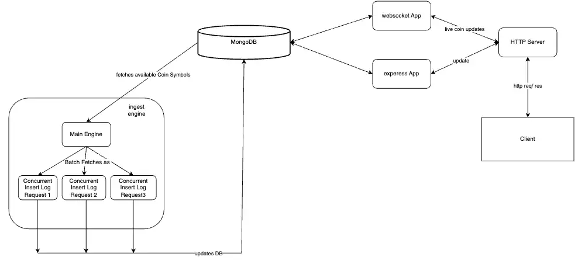

##System Design
 
<a href="https://drive.google.com/file/d/1T253V5yif0cUKLpnJpwFW1D45Emw5kat/view">source</a>

##How To Setup

###Frontend
```
npm install
```
###Backend
Install Dependencies
```
npm install
```
##How to start

###Frontend
<bold>Start Frontend Server</bold>

```
npm start
```
###Backend
In bankend we have to start three components.
1.updateEngine -> responsible for updating coins every 10second.
2.liveUpdateWebSocket -> websocket for updating live crypto price.
3.Express Server -> for our RestAPIs

<bold>Execute follwoing commands in seperate terminals</bold>

####Run the below command to start update engine
```
npm run engine
```

####Run the below command to start websocket
```
npm run serve
```